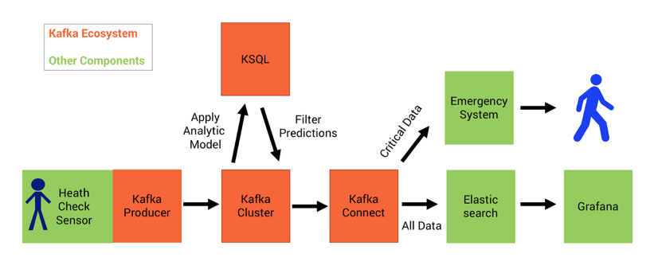

#  Deep Learning UDF for KSQL, the Streaming SQL for Apache Kafka

*Important: This is a fork of the KSQL project to demonstrate how to built a User-Defined Function (UDF). The projects adds a H2O Deep Learning model.*

For the most up-to-date version, documentation and examples of KSQL, please go to [Confluent's official KSQL Github repository](https://github.com/confluentinc/ksql).

*Update July 2018: KSQL now has official support for UDFs. This makes it much easier to implement UDFs. I built an updated example here: [KSQL UDF with Deep Learning using MQTT Proxy for Sensor Analytics](https://github.com/kaiwaehner/ksql-udf-deep-learning-mqtt-iot)... Also check out the Confluent Documentation for more information about the new UDF / UDAF features in [KSQL Custom Function Reference UDF / UDAF](https://docs.confluent.io/current/ksql/docs/udf.html)*

## Use Case: Continuous Health Checks with Anomaly Detection
The following example leverages a pre-trained analytic model within a KSQL UDF for continuous stream processing in real time to do health checks and alerting in case of risk. The Kafka ecosystem is used for model serving, monitoring and alerting.

### Deep Learning with an H2O Autoencoder for Sensor Analytics
Each row (i.e. message input from the sensor to Kafka) represents a single heartbeat and contains over 200 columns with numbers.

The [User-Defined KSQL Function ‘AnomalyKudf’ applies an H2O Neural Network](https://github.com/kaiwaehner/ksql/blob/4.0.x/ksql-engine/src/main/java/io/confluent/ksql/function/udf/ml/AnomalyKudf.java). The class creates a new object instance of the Deep Learning model and applies it to the incoming sensor messages for detection of anomalies in real time.

## Slides

See https://speakerdeck.com/rmoff/processing-iot-data-with-apache-kafka-ksql-and-machine-learning

## Demo script

See [demo.adoc](demo.adoc)

## Quick Start for KSQL Machine Learning UDF
How to test this implementation? The analytic model and its dependency is already included in this project. You just have to start a Kafka broker (including Zookeeper) and the KSQL server to send input streams for model inference. Here are the steps...

### Build

UDFs currently need to rebuild the KSQL project to include the new function.

However, the Maven build for KSQL is already done in this project.  If you want to change the UDF logic or add own models, then you need to rebuild the project.

    mvn -DskipTests=true -Dcheckstyle.skip=true clean package

### Set up the infrastructure

Confluent CLI needs to be set up to start a new cluster the easiest way - https://github.com/confluentinc/confluent-cli
Alternatively, you can use an existing Kafka cluster with default broker URL (or reconfigure the ksql-server.properties file to point to your existing Kafka cluster URL).

Start Kafka (also starts Zookeeper as dependency):

    confluent start kafka
    
Start Kafka Connect (not needed for KSQL, but used for integrating with Elastic for the demo):
    
    confluent start connect

Start the KSQL Server:

    bin/ksql-server-start config/ksql-server.properties

Start the KSQL CLI (or alternatively use the KSQL UI):

    bin/ksql http://localhost:8088

The following creates topics and test data manually so that you can follow each step. See below for steps on generating random test data continually

This example uses [kafacat](https://github.com/edenhill/kafkacat/), an open-source command line tool for easily interacting with Kafka.

Create a Kafka Topic for this demo:

    kafka-topics \
    --zookeeper localhost:2181 \
    --create \
    --topic HealthSensorInputTopic \
    --partitions 1 \
    --replication-factor 1

In KSQL, create STREAM and SELECT Queries:

    CREATE STREAM healthsensor (eventid integer, sensorinput varchar) WITH (kafka_topic='HealthSensorInputTopic', value_format='DELIMITED');
    CREATE STREAM SENSOR_RAW WITH (VALUE_FORMAT='AVRO') AS SELECT * FROM HEALTHSENSOR;
    SHOW STREAMS;
    DESCRIBE healthsensor;
    SELECT eventid, anomaly(SENSORINPUT) from healthsensor;

Send a sample message (returns a prediction of 1.2104138026620321):

    echo -e "99999,2.10# 2.13# 2.19# 2.28# 2.44# 2.62# 2.80# 3.04# 3.36# 3.69# 3.97# 4.24# 4.53#4.80# 5.02# 5.21# 5.40# 5.57# 5.71# 5.79# 5.86# 5.92# 5.98# 6.02# 6.06# 6.08# 6.14# 6.18# 6.22# 6.27#6.32# 6.35# 6.38# 6.45# 6.49# 6.53# 6.57# 6.64# 6.70# 6.73# 6.78# 6.83# 6.88# 6.92# 6.94# 6.98# 7.01#7.03# 7.05# 7.06# 7.07# 7.08# 7.06# 7.04# 7.03# 6.99# 6.94# 6.88# 6.83# 6.77# 6.69# 6.60# 6.53# 6.45#6.36# 6.27# 6.19# 6.11# 6.03# 5.94# 5.88# 5.81# 5.75# 5.68# 5.62# 5.61# 5.54# 5.49# 5.45# 5.42# 5.38#5.34# 5.31# 5.30# 5.29# 5.26# 5.23# 5.23# 5.22# 5.20# 5.19# 5.18# 5.19# 5.17# 5.15# 5.14# 5.17# 5.16#5.15# 5.15# 5.15# 5.14# 5.14# 5.14# 5.15# 5.14# 5.14# 5.13# 5.15# 5.15# 5.15# 5.14# 5.16# 5.15# 5.15#5.14# 5.14# 5.15# 5.15# 5.14# 5.13# 5.14# 5.14# 5.11# 5.12# 5.12# 5.12# 5.09# 5.09# 5.09# 5.10# 5.08# 5.08# 5.08# 5.08# 5.06# 5.05# 5.06# 5.07# 5.05# 5.03# 5.03# 5.04# 5.03# 5.01# 5.01# 5.02# 5.01# 5.01#5.00# 5.00# 5.02# 5.01# 4.98# 5.00# 5.00# 5.00# 4.99# 5.00# 5.01# 5.02# 5.01# 5.03# 5.03# 5.02# 5.02#5.04# 5.04# 5.04# 5.02# 5.02# 5.01# 4.99# 4.98# 4.96# 4.96# 4.96# 4.94# 4.93# 4.93# 4.93# 4.93# 4.93# 5.02# 5.27# 5.80# 5.94# 5.58# 5.39# 5.32# 5.25# 5.21# 5.13# 4.97# 4.71# 4.39# 4.05# 3.69# 3.32# 3.05#2.99# 2.74# 2.61# 2.47# 2.35# 2.26# 2.20# 2.15# 2.10# 2.08" | kafkacat -b localhost:9092 -P -t HealthSensorInputTopic

Create derived stream in KSQL:

    CREATE STREAM AnomalyDetection WITH (VALUE_FORMAT='AVRO') AS \
    SELECT eventid, sensorinput, \
    CAST (anomaly(sensorinput) AS DOUBLE) as Anomaly \
    FROM healthsensor;

Now create a filter so that you only get specific messages (could be alerts):

    CREATE STREAM AnomalyDetectionBreach AS \
    SELECT * FROM AnomalyDetection \
    WHERE Anomaly >1.3;

    SELECT * FROM AnomalyDetection;

    SELECT * FROM AnomalyDetectionWithFilter;

Send another test message. This one returns a prediction of 1.4191201699929437:

    echo -e  "33333, 6.90#6.89#6.86#6.82#6.78#6.73#6.64#6.57#6.50#6.41#6.31#6.22#6.13#6.04#5.93#5.85#5.77#5.72#5.65#5.57#5.53#5.48#5.42#5.38#5.35#5.34#5.30#5.27#5.25#5.26#5.24#5.21#5.22#5.22#5.22#5.20#5.19#5.20#5.20#5.18#5.19#5.19#5.18#5.15#5.13#5.10#5.07#5.03#4.99#5.00#5.01#5.06#5.14#5.31#5.52#5.72#5.88#6.09#6.36#6.63#6.86#7.10#7.34#7.53#7.63#7.64#7.60#7.38#6.87#6.06#5.34#5.03#4.95#4.84#4.69#4.65#4.54#4.49#4.46#4.43#4.38#4.33#4.31#4.28#4.26#4.21#4.19#4.18#4.15#4.12#4.09#4.08#4.07#4.03#4.01#4.00#3.97#3.94#3.90#3.90#3.89#3.85#3.81#3.81#3.79#3.77#3.74#3.72#3.71#3.70#3.67#3.66#3.68#3.67#3.66#3.67#3.69#3.71#3.72#3.75#3.80#3.85#3.89#3.95#4.03#4.06#4.18#4.25#4.36#4.45#4.54#4.60#4.68#4.76#4.83#4.86#4.91#4.95#4.97#4.98#5.00#5.04#5.04#5.05#5.03#5.06#5.07#5.06#5.05#5.06#5.07#5.07#5.06#5.06#5.07#5.07#5.06#5.07#5.07#5.08#5.06#5.06#5.08#5.09#5.09#5.10#5.11#5.11#5.10#5.10#5.11#5.12#5.10#5.06#5.07#5.06#5.05#5.02#5.02#5.02#5.01#4.99#4.98#5.00#5.00#5.00#5.02#5.03#5.03#5.01#5.01#5.03#5.04#5.02#5.01#5.02#5.04#5.02#5.02#5.03#5.04#5.03#5.03#5.02#5.04#5.04#5.03#5.03#5.05#5.04" | kafkacat -b localhost:9092 -P -t HealthSensorInputTopic

Inspect the resulting Kafka topics. One with all scored events:

    $ kafkacat -b localhost:9092 -C -t ANOMALYDETECTION
    99999,1.2104138026620321
    % Reached end of topic ANOMALYDETECTION [1] at offset 0
    % Reached end of topic ANOMALYDETECTION [2] at offset 0
    33333,1.4191201699929437
    % Reached end of topic ANOMALYDETECTION [3] at offset 1
    % Reached end of topic ANOMALYDETECTION [0] at offset 1

One with just those that breach an alert:

    $ kafkacat -b localhost:9092 -C -t ANOMALYDETECTIONWITHFILTER
    % Reached end of topic ANOMALYDETECTIONWITHFILTER [0] at offset 0
    % Reached end of topic ANOMALYDETECTIONWITHFILTER [1] at offset 0
    33333,1.4191201699929437
    % Reached end of topic ANOMALYDETECTIONWITHFILTER [3] at offset 0
    % Reached end of topic ANOMALYDETECTIONWITHFILTER [2] at offset 1

### Replaying sample test data

Taking an input file of readings only, this will add a sequence number:

    awk '{gsub(/\,/,"#");print NR","$0}' ecg_discord_test.csv > ecg_discord_test.msgs

Play data into Kafka:

    kafkacat -b localhost:9092 -P -t HealthSensorInputTopic -l ecg_discord_test.msgs

Generates all readings with same/close timestamp though. To spread out over time, use `pv` to throttle to a given bytes/sec throughput:

    cat ecg_discord_test.msgs | pv -q -L 1000| kafkacat -b localhost:9092 -P -t HealthSensorInputTopic

Run continually:

    cd test-data
    ./stream_loop_of_test_data_into_kafka.sh

### Generating random test data

    ./bin/ksql-datagen schema=EcdSensorData.avro format=delimited topic=HealthSensorInputTopic key=eventid maxInterval=2000

This uses the ksql-datagen tool (part of KSQL project) to generate test data. Whilst it provides random data, it's not very realistic to real-world data since it is truly random, rather than following a particular realistic pattern.

### Change anomaly threshold

    TERMINATE CSAS_ANOMALYDETECTIONBREACH;
    DROP STREAM ANOMALYDETECTIONBREACH;
    CREATE STREAM AnomalyDetectionBreach AS \
    SELECT * FROM AnomalyDetection \
      WHERE Anomaly >4;

## Stream to Elasticsearch

Create a Kafka Connect sink to stream all scored events to Elasticsearch:

    curl -X "POST" "http://localhost:8083/connectors/" \
       -H "Content-Type: application/json" \
       -d '{
        "name": "es_sink_raw_events",
        "config": {
          "topics": "SENSOR_RAW",
          "key.converter": "org.apache.kafka.connect.storage.StringConverter",
          "connector.class": "io.confluent.connect.elasticsearch.ElasticsearchSinkConnector",
          "key.ignore": "true",
          "schema.ignore": "true",
          "type.name": "type.name=kafkaconnect",
          "topic.index.map": "SENSOR_RAW:healthsensorinput_raw",
          "connection.url": "http://localhost:9200",
          "transforms": "ExtractTimestamp",
          "transforms.ExtractTimestamp.type": "org.apache.kafka.connect.transforms.InsertField$Value",
          "transforms.ExtractTimestamp.timestamp.field" : "EXTRACT_TS"
        }
      }'

    curl -X "POST" "http://localhost:8083/connectors/" \
             -H "Content-Type: application/json" \
             -d '{
          "name": "es_sink_anomaly",
          "config": {
            "topics": "ANOMALYDETECTION",
            "key.converter": "org.apache.kafka.connect.storage.StringConverter",
            "connector.class": "io.confluent.connect.elasticsearch.ElasticsearchSinkConnector",
            "key.ignore": "true",
            "schema.ignore": "true",
            "type.name": "type.name=kafkaconnect",
            "topic.index.map": "ANOMALYDETECTION:healthsensorinput_scored",
            "connection.url": "http://localhost:9200",
            "transforms": "ExtractTimestamp",
            "transforms.ExtractTimestamp.type": "org.apache.kafka.connect.transforms.InsertField$Value",
            "transforms.ExtractTimestamp.timestamp.field" : "EXTRACT_TS"
          }
        }'

Create a Kafka Connect sink to stream all events that breach an alert threadshold to Elasticsearch:

    curl -X "POST" "http://localhost:8083/connectors/" \
             -H "Content-Type: application/json" \
             -d '{
          "name": "es_sink_anomaly_alerts",
          "config": {
            "topics": "ANOMALYDETECTIONBREACH",
            "key.converter": "org.apache.kafka.connect.storage.StringConverter",
            "connector.class": "io.confluent.connect.elasticsearch.ElasticsearchSinkConnector",
            "key.ignore": "true",
            "schema.ignore": "true",
            "type.name": "type.name=kafkaconnect",
            "topic.index.map": "ANOMALYDETECTIONBREACH:healthsensorinput_alerts",
            "connection.url": "http://localhost:9200",
            "transforms": "ExtractTimestamp",
            "transforms.ExtractTimestamp.type": "org.apache.kafka.connect.transforms.InsertField$Value",
            "transforms.ExtractTimestamp.timestamp.field" : "EXTRACT_TS"
          }
        }'

## Viualisation

## Monitoring

Optionally, start the Confluent Control Center :

    confluent start control-center

Once started, go to http://localhost:9021/monitoring/streams/ to monitor the pipelines you have built

# Join the Confluent Community
Whether you need help, want to contribute, or are just looking for the latest news around the Apache Kafka ecosystem and Confluent, you can find out how to [connect with your fellow Confluent community members here](https://www.confluent.io/contact-us-thank-you/).

* Ask a question in the #ksql channel in Confluent's public [Confluent Community Slack](https://slackpass.io/confluentcommunity). Account registration is free and self-service.
* Join the [Confluent Google group](https://groups.google.com/forum/#!forum/confluent-platform).

If you have feedback regarding the Kafka ecosystem and Machine Learning, feel free to contact me directly via LinkedIn, Twitter or Email. Also check out my other [Kafka-ML Github project](https://github.com/kaiwaehner/kafka-streams-machine-learning-examples) where I leverage Kafka's Streams API to apply analytic models trained with H2O, TensorFlow and DeepLearning4j.

## Next Steps (hopefully) coming soon:
- Real demo sensor data (i.e. a continous stream)
- Integration with Kafka Connect
- More business logic and different analytic models in the UDF

# Contributing
Contributions to the code, examples, documentation, etc, are very much appreciated.

- Report issues and bugs directly in [this GitHub project](https://github.com/kaiwaehner/ksql/issues).

# License
The project is licensed under the Apache License, version 2.0.

*Apache, Apache Kafka, Kafka, and associated open source project names are trademarks of the [Apache Software Foundation](https://www.apache.org/).*
